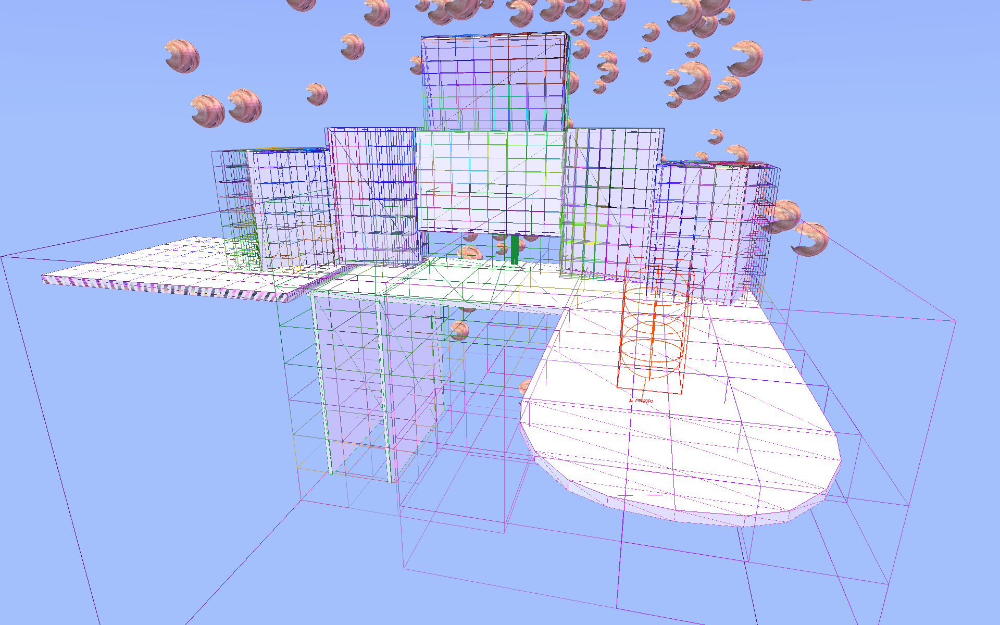

# Magpie

this is a several-years-long single-idiot attempt to write a 3D game engine. it's going alright 
it's called magpie because I like magpies and naming projects after birds 

here are some images of the nonsense it's capable of 
I have no way to explain the use of tump programmer art. tumpl 

tirmp

this is mostly a dead project, untouched in months with enormous gaping holes torn in it from my last few attempts to solve issues with it 

the 3D GJK needs to be torn out, have a lot of debug code re-added to it, and to be tested thoroughly 
it then needs to be put back, re-integrated with the collision resolution threads, which also probably need to be redone or at least reactivated 
it probably needs a new object system, like a proper ECS implementation, instead of the mess it is now 
it definitely needs the very nice octree system to be actually implemented in any way

at this point, it's basically just sitting around for me to pull pieces from for my other projects 

however 

### the pieces
- 2D GJK collision detection
- 3D GJK swept collision detection (broken) with EPA (working)
- Octree-based world space and mesh collision test partitioning
- Deferred dynamic lighting, currently supporting spot lights with shadows and point lights without
- An ambient lighting system that takes a colour gradient to determine how the lighting will change over time (basically a day/night cycle with arbitrary lighting colours and brightnesses)
- Update loop in separate thread from drawing, with a fixed tick rate (and, in the future, interpolation in the rendering thread)
- Easily useable global handling of shared content through ContentHandler ('ContentHandler.resources["OnePXWhite"].value_tx' will get the texture "OnePXWhite", which is a 1x1 white square created by the ContentHandler on load)
- Similar system for controls and control bindings, also threaded (to be supplemented with a RawInput-based setup (and rewritten to utilize it to the fullest) in the near future)
- Persistent game variable system, (currently) saving settings to a file simply called "gvars" in the same folder as the executable, these are easily set through, for example, gvars.set("vsync", true);
- Automatic, clean handling of things like changing graphics modes through the gvar system (running 'gvars.set("resolution", new XYPair(720,1280))' will immediately switch to 720x1280, a portrait resolution, without issue) 
- Internal resolution scaling, also handled through gvars
- 3D heightmaps with octree-based chunks built in
- Point clouds/particles
- 2D SDFs with support for things like scrolling textured, tinted outlines
- An entire window manager, as well as a WinForms-esque UI Forms system. *this is not a bit*
- the console is a very usable cs-script C# REPL (with full keyboard and mouse support, arrows/del/home/end, clipboard, undo/redo, etc, as well as a console colour system )
- A massive library of 2D/3D drawing and math utility code outside of all of this
- there's so many projects in here, many written in a single manic sitting

I have attempted to write several game engines before this one, and I will probably write several game engines in the future 